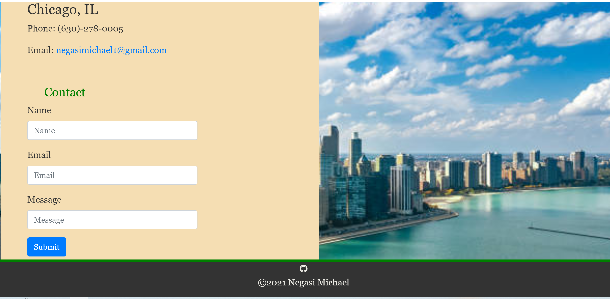
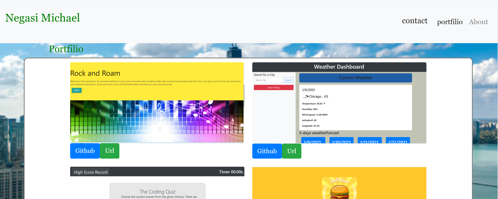
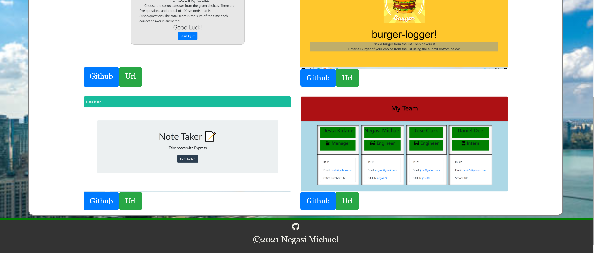

## react-portfolio
---------------------------------------------------------------------------------

## Description

This is Personal Portfolio build by React.js

 This application created with folder components and files About, Contact, Footer, Nav, Portfolio and style.css

 npm install for dependence

 build,

 gh-pages,

 axios

## Table of Contents
   * [Installation](#installation)
   
   * [Contribution](#contribution)
   
   * [Developer Contact Information](#Developer-Contact-Information)
     
  * [License](#license)

### Installation

npx create-react-app  < app name >

npm start

 ## Screenshots Image
   

Deployed: https://negasimichael.github.io/react-portfolio/
## Contribution
  [negasimichael](https://github.com/negasimichael/react-portfolio) is the only contrubuter of this project .

## Developer Contact Information
  * Linkedin Profile: [negasimichael](https://www.linkedin.com/feed/)
  * Deployed URL: [negasimichael](https://negasimichael.github.io/react-portfolio/)
  * Github URL: [negasimichael](https://github.com/negasimichael/react-portfolio)
  * Email: negasimichael1@gmail.com
  
## License
   .
 
 ------------------------------------------------------------------------------
© 2021 Trilogy Education Services, a 2U, Inc. brand. All Rights Reserved.

